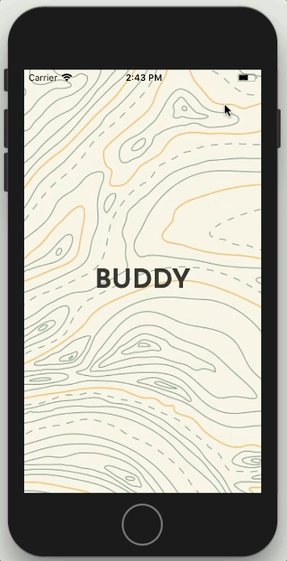
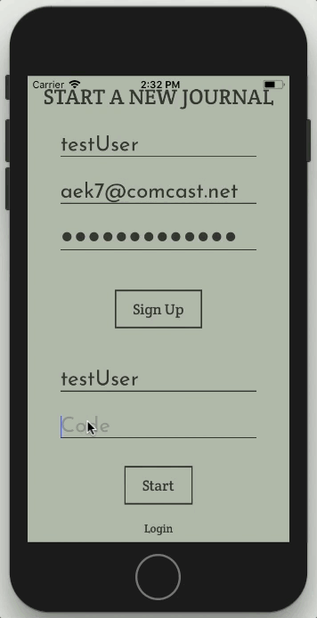
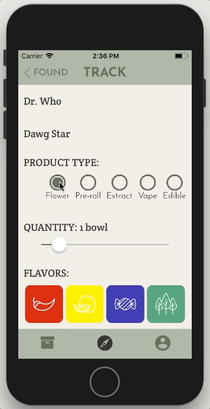
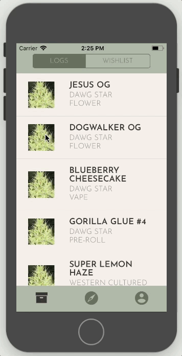
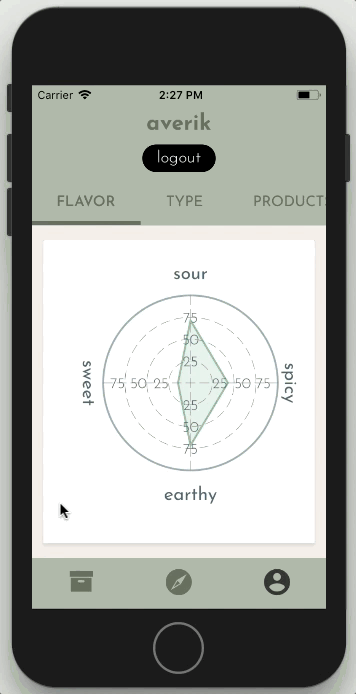

# Buddy  
[Ada Developers Academy Capstone Project](https://github.com/Ada-C8/capstone)  

This is the repository for Buddy - the cannabis tracking app - an ADA capstone project. The project was built using a MERN stack - MongoDB, Express, React Native and NodeJS. Please follow the links to find project information and installation instructions.

### Links
1. [Capstone Concept](https://gist.github.com/5cae13e9ddfbb129f2ec82423d85d949.git)
2. [Product Plan](https://github.com/averikitsch/buddy-capstone/blob/master/Buddy-Product-Plan.md)
3. [Trello Board](https://trello.com/b/SxJtfRGc/capstone)
4. [Front End](https://github.com/averikitsch/buddy-capstone/tree/master/Buddy)
5. [Back End](https://github.com/averikitsch/buddy-backend)

### Screenshots
#### Sign In / Sign Up

#### Search

#### Track

#### Profile

